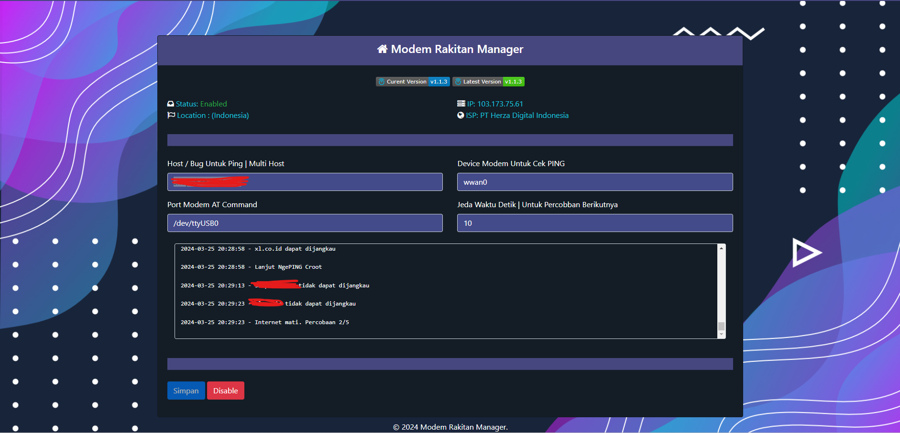
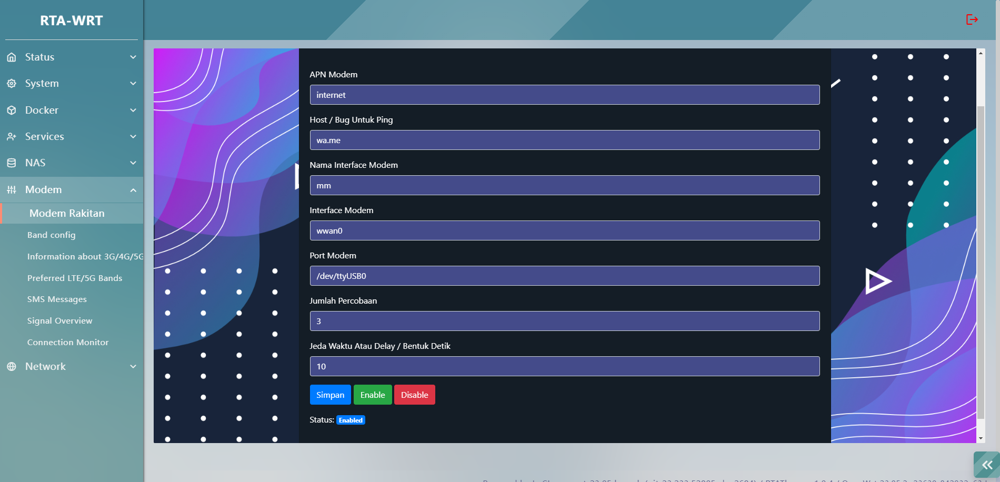
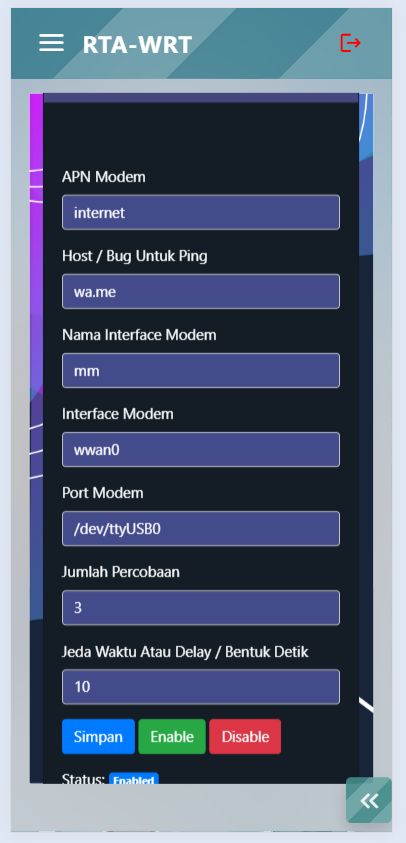

<h1 align="center">
   RTA App Rakitiw 

</h1>

  

	
    
    
  

  

luci-app-rakitiw

This OpenWRT Custom Script For Modem

 

Preview
---

* Full View

    

* Main View

    

* Mobile View

    

